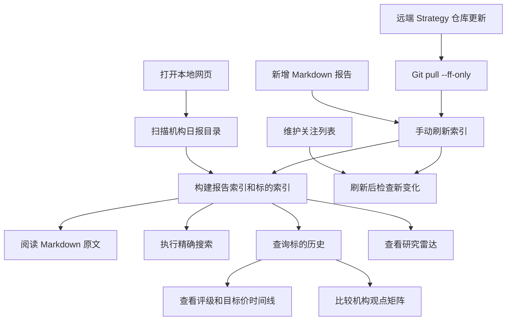

## 1. 产品概述
机构日报分析平台用于整理 `/Users/bytedance/ai-projects/Strategy/港A美/机构日报` 下全部 Markdown 报告，并在本地网页中提供报告阅读、精确搜索、标的提及追踪、评级与目标价变化分析，以及专业研究平台常用的机构观点对比、催化剂/风险提取和关注列表监控。
- 目标用户是需要复盘机构观点、查找标的历史覆盖、比较评级与目标价变化的投资研究使用者。
- 核心价值是把分散日报转成可检索、可追溯、可持续更新的本地研究工作台。

## 2. 核心功能

### 2.1 功能模块
1. **总览页**：报告数量、年份覆盖、最新报告、机构分布、近期重点标的。
2. **报告阅读页**：按日期浏览 Markdown 原文，保留标题、列表、加粗、高亮等 Markdown 排版。
3. **精确搜索页**：按关键词、机构、日期范围、行业标签进行精确搜索，展示命中文件、命中段落、行号与上下文。
4. **标的分析页**：输入标的名称或代码，查询历史日报中出现的日期、机构、相关段落、评级、目标价和观点变化。
5. **研究雷达页**：聚合近期首次覆盖、评级变更、目标价变化、催化剂、风险提示和热门主题。
6. **机构观点页**：按机构、行业、标的对比观点分歧、覆盖频率、评级分布和目标价区间。
7. **关注列表页**：维护重点标的，刷新索引后自动提示新增覆盖、评级变化、目标价变化和风险提示。
8. **索引管理页/更新中心**：展示索引状态、源目录路径、最后扫描时间，支持手动刷新索引，也支持对 Strategy 仓库执行 Git 更新后自动重建索引。

### 2.2 页面详情
| 页面名称 | 模块名称 | 功能描述 |
| --- | --- | --- |
| 总览页 | 数据概览 | 展示报告总数、年份分布、最近更新时间、机构覆盖数量 |
| 总览页 | 最新日报 | 按日期倒序列出最新日报，点击进入阅读 |
| 报告阅读页 | Markdown 阅读器 | 保持 Markdown 格式，支持目录、段落间距、重点高亮 |
| 报告阅读页 | 报告元信息 | 展示日期、年份、机构列表、提取到的标的数量 |
| 精确搜索页 | 搜索框 | 输入关键词后执行标准化精确匹配，不做模糊搜索 |
| 精确搜索页 | 筛选器 | 日期范围、机构、是否只看评级/目标价段落 |
| 精确搜索页 | 命中结果 | 展示报告日期、机构、行号、上下文，并可跳转到原文 |
| 标的分析页 | 标的输入 | 支持中文名、英文名、股票代码、港股/A股/美股代码形式 |
| 标的分析页 | 标的 360 档案 | 展示别名、代码、首次提及、最近提及、覆盖机构、相关行业标签 |
| 标的分析页 | 历史时间线 | 展示每次提及的日期、机构、评级、目标价、观点摘要 |
| 标的分析页 | 评级目标价表 | 汇总评级变化、目标价变化、是否首次覆盖/维持/上调/下调 |
| 标的分析页 | 观点变化摘要 | 自动归纳同一标的从早期到最近的核心分歧、正面因素、负面因素 |
| 研究雷达页 | 重点变化 | 展示首次覆盖、评级上调/下调、目标价上调/下调、30 天催化剂 |
| 研究雷达页 | 催化剂与风险 | 抽取财报、政策、上市、产能、订单、宏观、监管等催化剂与风险 |
| 研究雷达页 | 主题热度 | 按标签聚合 AI、半导体、券商、银行、地产、宏观等主题热度 |
| 机构观点页 | 机构矩阵 | 横向比较不同机构对同一标的的评级、目标价、最近覆盖日期 |
| 机构观点页 | 分歧榜 | 找出机构观点差异较大的标的，例如评级不一致或目标价区间较宽 |
| 机构观点页 | 覆盖榜 | 展示被最多机构覆盖、被最频繁提及的标的和行业 |
| 关注列表页 | 本地关注池 | 支持添加/移除关注标的，记录用户自定义别名和备注 |
| 关注列表页 | 新变化提醒 | 新增报告进入索引后，提示关注标的的新提及、评级与目标价变化 |
| 关注列表页 | 导出 | 支持把当前搜索结果、标的时间线、机构观点矩阵导出为 CSV/JSON |
| 索引管理页 | 刷新索引 | 重新扫描日报目录，整理新增或修改过的报告 |
| 索引管理页 | Git 更新 | 对 `/Users/bytedance/ai-projects/Strategy` 执行 `git pull --ff-only`，成功后自动重建索引 |
| 索引管理页 | 数据质量 | 展示未识别机构、疑似重复标的、无法提取日期、目标价解析失败等问题 |

### 2.3 精确搜索口径
- 文本搜索采用标准化后的严格包含匹配：大小写统一、全角半角统一、空白符压缩、常见标点归一化。
- 标的搜索采用“别名集合精确命中”：同一标的可以由名称、英文名、代码、带交易所后缀代码命中。
- 不使用模糊搜索、拼音联想或语义联想，避免不相关结果混入。
- 命中结果必须保留来源报告路径、日期、机构块、行号与原文上下文。

### 2.4 专业分析能力
- **标的 360 档案**：把同一标的的中文名、英文名、代码、交易所后缀、常见简称汇总到同一个档案中，避免查询时遗漏历史提及。
- **评级与目标价变更检测**：按时间排序比较同一机构或全部机构对某标的的评级和目标价，标记首次覆盖、维持、上调、下调、恢复覆盖、移除覆盖。
- **机构观点矩阵**：对同一标的展示不同机构的最新评级、目标价、报告日期、观点摘要和风险点，便于观察共识与分歧。
- **催化剂/风险/估值抽取**：从报告段落中提取“催化剂、风险、估值、目标价、投资逻辑、财务亮点”等结构化片段。
- **主题与行业雷达**：根据标签和正文关键词聚合热门主题，展示近期哪些方向被机构密集讨论。
- **关注列表监控**：用户维护重点标的池，刷新索引后优先展示关注标的的新报告、新评级、新目标价和新风险提示。
- **别名管理**：支持在本地补充或合并标的别名，处理同一标的在不同报告中名称不一致的问题。
- **导出与复盘**：搜索结果、标的历史、机构矩阵可导出，方便后续写纪要或做二次分析。
- **数据质量面板**：列出疑似解析异常，帮助发现报告格式变化、标的识别遗漏或目标价提取失败。
- **日报更新中心**：在本地网页里触发 Strategy 仓库的安全更新流程，使用快进模式拉取最新日报，避免覆盖本地改动。

## 3. 核心流程
用户先进入总览页查看报告库状态和研究雷达，再通过报告阅读页阅读原文，或在精确搜索页输入关键词定位报告段落。若用户关注某一标的，则进入标的分析页输入名称或代码，系统基于索引展示该标的在历史日报中的所有提及，并提取评级、目标价、催化剂、风险和观点变化。需要比较机构观点时，用户进入机构观点页查看同一标的在不同机构之间的共识与分歧。新增日报写入源目录后，用户可在索引管理页直接刷新索引；若新增内容来自远端 Git 仓库，则点击 Git 更新，系统先执行 `git pull --ff-only`，成功后自动重建索引；关注列表会优先提示相关标的新变化。

## 4. 用户界面设计

### 4.1 设计风格
- 视觉方向：金融研究终端与高级编辑台结合，清爽、留白充足、信息层级清楚。
- 主色：深墨蓝 `#102033`；辅助色：纸张米白 `#F6F0E6`；强调色：铜金 `#C4873A` 与冷青 `#2D9CDB`。
- 字体：中文正文优先使用系统宋体/苹方回退，标题使用更有编辑感的衬线风格；代码和股票代码使用等宽字体。
- 布局：桌面优先，左侧导航，主内容双栏或三栏；报告正文使用宽松行距和卡片式章节。
- 交互：搜索结果 hover 高亮，时间线平滑展开，重要指标使用低饱和标签。

### 4.2 页面设计概览
| 页面名称 | 模块名称 | UI 元素 |
| --- | --- | --- |
| 总览页 | 顶部摘要 | 大号数字卡、最近报告日期、索引状态灯 |
| 总览页 | 机构与年份分布 | 简洁条形图、年份筛选胶囊 |
| 报告阅读页 | 原文阅读 | 类研究简报排版、章节锚点、命中高亮 |
| 精确搜索页 | 搜索面板 | 大搜索框、筛选 chips、结果计数 |
| 标的分析页 | 标的档案 | 名称、代码、别名、首次/最近提及 |
| 标的分析页 | 评级时间线 | 日期轴、机构标签、评级与目标价卡片 |
| 研究雷达页 | 变化看板 | 首次覆盖、评级变化、目标价变化、催化剂、风险的分组瀑布流 |
| 机构观点页 | 对比矩阵 | 机构为列、标的为行，评级/目标价/日期使用清晰标签 |
| 关注列表页 | 监控卡片 | 标的卡片、最新变化 badge、用户备注、导出按钮 |
| 索引管理页 | 状态面板 | 源目录、文件数、最后扫描、刷新按钮 |

### 4.3 响应式
桌面优先，同时支持手机端使用；窄屏下导航折叠为顶部横向导航，并提供底部常用入口栏。报告正文、搜索表单、更新按钮和机构矩阵在手机端改为单栏或纵向卡片，保证触控区域足够大、文字不拥挤。
