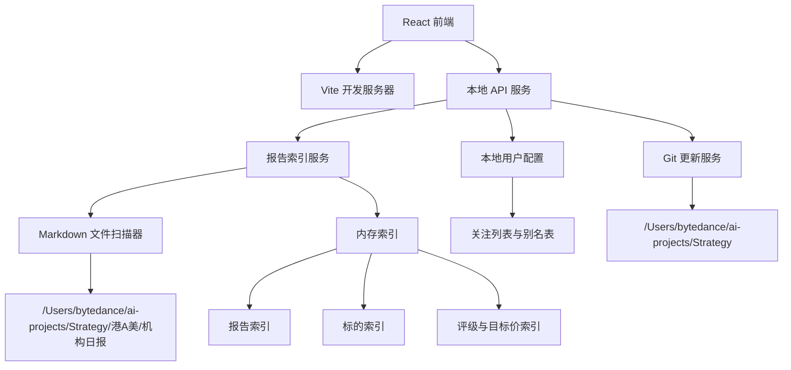
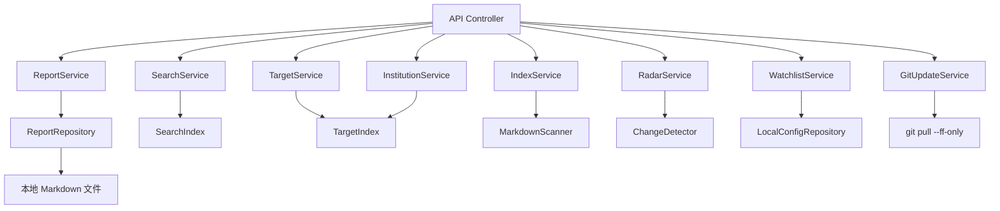
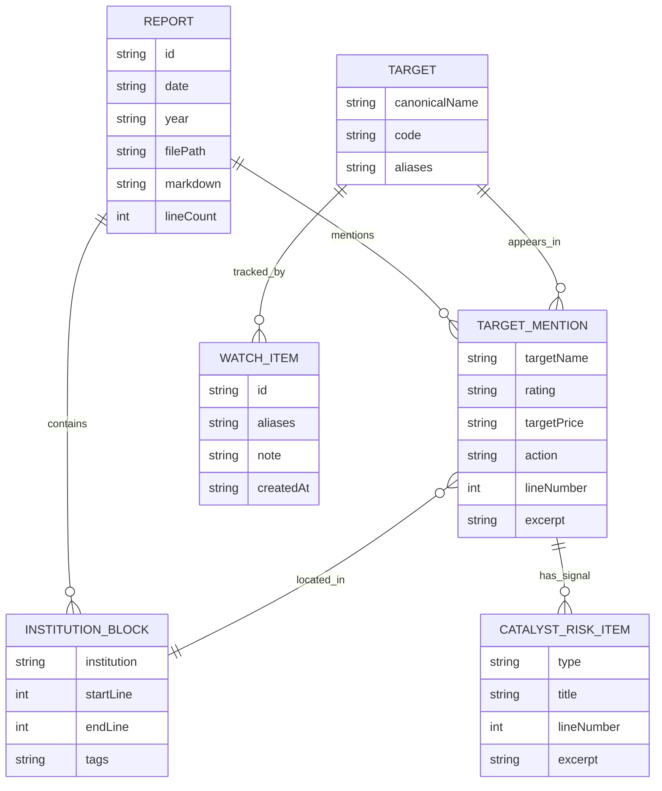

## 1. 架构设计
本项目采用本地全栈架构：前端负责展示、筛选和交互；Node 本地服务负责读取 Markdown、解析报告结构、构建内存索引、维护本地配置并提供 API。数据来源只依赖本机文件系统，不引入外部数据库或在线服务。



## 2. 技术说明
- 前端：React + Vite。
- 后端：Node.js + Express，本地运行。
- Markdown 渲染：`react-markdown` + `remark-gfm`，保留表格、列表、加粗和段落结构。
- 搜索与索引：自研本地索引，采用标准化精确匹配，避免模糊匹配误报。
- 数据存储：默认内存索引；关注列表、别名表、用户备注存储在项目内本地 JSON 文件；如后续报告规模明显增大，可扩展为 SQLite。
- 源目录：`/Users/bytedance/ai-projects/Strategy/港A美/机构日报`。

## 3. 路由定义
| 路由 | 用途 |
| --- | --- |
| `/` | 总览页，展示报告库状态和入口 |
| `/reports` | 报告列表与 Markdown 阅读 |
| `/search` | 精确搜索报告内容 |
| `/targets` | 标的历史提及、评级与目标价分析 |
| `/radar` | 研究雷达，展示近期变化、催化剂、风险和主题热度 |
| `/institutions` | 机构观点矩阵和分歧分析 |
| `/watchlist` | 关注列表、新变化提醒、用户备注与导出 |
| `/index` | 索引状态、刷新、Git 更新与重建 |

## 4. API 定义

```ts
type InstitutionBlock = {
  institution: string;
  startLine: number;
  endLine: number;
  tags: string[];
};

type ReportSummary = {
  id: string;
  date: string;
  year: string;
  filePath: string;
  title: string;
  institutions: string[];
  targetCount: number;
  lineCount: number;
  updatedAt: string;
};

type SearchHit = {
  reportId: string;
  date: string;
  institution: string;
  lineNumber: number;
  snippet: string;
  matchedText: string;
};

type TargetMention = {
  reportId: string;
  date: string;
  institution: string;
  targetName: string;
  aliases: string[];
  code?: string;
  rating?: string;
  targetPrice?: string;
  action?: string;
  lineNumber: number;
  excerpt: string;
};

type CatalystRiskItem = {
  reportId: string;
  date: string;
  institution: string;
  targetName?: string;
  type: "catalyst" | "risk" | "valuation" | "financial" | "macro";
  title: string;
  excerpt: string;
  lineNumber: number;
};

type RatingChange = {
  targetKey: string;
  targetName: string;
  institution: string;
  previousRating?: string;
  currentRating?: string;
  previousTargetPrice?: string;
  currentTargetPrice?: string;
  changeType: "首次覆盖" | "维持" | "上调" | "下调" | "恢复覆盖" | "新增目标价" | "目标价变化";
  date: string;
  reportId: string;
};

type WatchItem = {
  id: string;
  name: string;
  aliases: string[];
  note?: string;
  createdAt: string;
};

type StrategyUpdateResult = {
  pull: {
    success: boolean;
    strategyDir: string;
    stdout: string;
    stderr: string;
    startedAt: string;
    finishedAt: string;
  };
  index: {
    sourceDir: string;
    indexedAt?: string;
    reportCount: number;
    mentionCount: number;
    errors: Array<{ filePath: string; message: string }>;
  };
};
```

| 方法 | 路径 | 说明 |
| --- | --- | --- |
| `GET` | `/api/summary` | 获取报告总数、年份分布、机构分布、索引状态 |
| `GET` | `/api/reports` | 获取报告列表，支持日期和机构筛选 |
| `GET` | `/api/reports/:id` | 获取单篇报告 Markdown 原文和结构化元数据 |
| `GET` | `/api/search?q=&from=&to=&institution=&mode=` | 精确搜索文本，`mode` 支持全文、评级、目标价 |
| `GET` | `/api/targets?q=` | 搜索标的名称/代码，返回历史提及和评级目标价变化 |
| `GET` | `/api/radar?from=&to=` | 获取首次覆盖、评级变化、目标价变化、催化剂、风险和主题热度 |
| `GET` | `/api/institutions?target=&institution=` | 获取机构观点矩阵、覆盖频率和观点分歧 |
| `GET` | `/api/watchlist` | 获取本地关注列表和最新变化 |
| `POST` | `/api/watchlist` | 添加关注标的、别名和备注 |
| `DELETE` | `/api/watchlist/:id` | 移除关注标的 |
| `POST` | `/api/aliases` | 合并或补充标的别名 |
| `GET` | `/api/export?type=&q=` | 导出搜索结果、标的时间线或机构矩阵 |
| `POST` | `/api/reindex` | 重新扫描目录并重建索引，用于新增报告整理 |
| `POST` | `/api/update-strategy` | 在 Strategy 仓库执行 `git pull --ff-only`，成功后自动重建索引 |

## 5. 服务端架构图



## 6. 数据模型

### 6.1 数据模型定义


### 6.2 解析策略
- 报告日期：优先从文件名提取，例如 `2026-07-08.md`。
- 机构块：识别一级标题 `# 机构名`，排除标签行如 `#高盛 #半导体 #AH`。
- 标签：识别行内连续 `#机构 #行业 #市场` 标签。
- 标的名称与代码：
  - 识别常见格式：`公司名 (代码)`、`公司名（代码）`、`代码.HK`、`代码.SS`、`代码.SZ`、`AAPL.US`、`TSLA` 等。
  - 将同一段落中出现的公司名、英文名、代码合并为别名集合。
  - 标的搜索时必须命中别名集合或原文严格包含，不做语义扩展。
- 评级：识别 `买入`、`增持`、`中性`、`卖出`、`减持`、`持有`、`首次覆盖`、`维持`、`上调`、`下调`、`OW`、`UW`、`Buy`、`Hold`、`Sell` 等关键词。
- 目标价：识别 `目标价`、`TP`、`PT`、`target price` 及相邻价格表达，如 `114 港元`、`210 美元`、`人民币 41.99 元`。
- 观点摘要：从命中行向前后扩展若干行，截取包含评级、目标价或标的名称的短段落。
- 评级变更检测：
  - 按标的、机构、日期排序，同一机构前后两次评级或目标价不同则生成变化记录。
  - 若首次出现评级或目标价，标记为首次覆盖或新增目标价。
  - 若报告原文出现“上调、下调、维持、首次覆盖、恢复覆盖”等动作词，优先使用原文动作。
- 催化剂与风险抽取：
  - 识别标题或段落中的 `催化剂`、`风险`、`估值`、`投资逻辑`、`财务亮点`、`宏观`、`政策`、`监管`、`财报`、`订单`、`产能` 等关键词。
  - 与最近的标的提及和机构块关联；无法关联标的时作为报告级信号展示。
- 机构观点矩阵：
  - 以标的为主键聚合不同机构的最新一条有效评级和目标价。
  - 对目标价保留原文货币和单位，不强制换算；若报告含当前股价，则计算原文口径下的潜在空间。
- 关注列表和别名管理：
  - 本地 JSON 文件保存用户关注标的、补充别名和备注。
  - 刷新索引后根据关注标的别名集合生成新变化提醒。
  - 别名合并只影响本地索引展示，不修改原始 Markdown 报告。
- Git 更新：
  - 固定仓库路径为 `/Users/bytedance/ai-projects/Strategy`，不接收前端传入的任意路径。
  - 使用 `git pull --ff-only`，避免自动 merge 或覆盖本地改动。
  - 成功后调用重建索引流程；失败时返回 Git 错误输出并保留当前索引。
- 手机端支持：
  - 顶部横向导航保留完整入口，底部固定导航提供总览、报告、搜索、标的、更新五个高频入口。
  - 表单、按钮组、卡片矩阵在窄屏下改为单栏展示，保证阅读和触控。

## 7. 验证方案
- 使用全部 306 篇 Markdown 构建索引，确认无读取失败。
- 用已知样例验证：
  - `SpaceX` 能命中 2026-07-08 瑞银报告，并提取买入、目标价 210 美元。
  - `英诺赛科` 或 `2577.HK` 能命中 2026-07-08 高盛报告，并提取买入、目标价 114 港元。
  - `中金公司` 或 `3908.HK` 能命中 2026-07-08 花旗报告，并展示 30 天上行催化剂和目标价。
- 验证研究雷达能展示 2026-07-08 中的首次覆盖、30 天上行催化剂、风险与宏观内容。
- 验证机构观点矩阵能对同一标的展示不同机构最新观点；若只有一家机构覆盖，应明确显示“暂无可比机构”。
- 验证关注列表添加 `英诺赛科` 后，刷新索引能展示与其相关的最新报告变化。
- 验证别名管理添加 `InnoScience` 后，搜索 `英诺赛科` 和 `InnoScience` 能归并到同一标的档案。
- 验证导出接口能输出 CSV/JSON，且字段包含日期、机构、标的、评级、目标价、来源报告和行号。
- 验证 Git 更新服务固定执行 `git pull --ff-only`，返回 stdout/stderr，并在成功后重建索引。
- 验证手机宽度下底部导航、搜索表单、索引更新按钮和报告阅读页面可用。
- 新增一篇临时 Markdown 测试报告后执行刷新索引，确认新增内容可被搜索；验证后删除临时文件。
