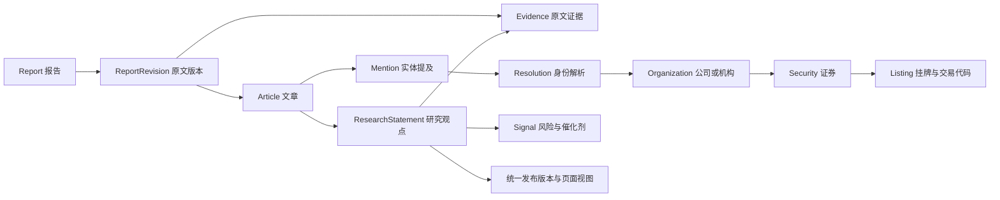

# 统一研究数据结构 v1.0

状态：待用户审核的定稿候选。日期：2026-09-16。

本稿已按2026-09-16新增要求修订为“程序候选+AI复核”。处理流程以[混合重构方案](research-hybrid-refactor-v1.md)为准，取值以[共用枚举表](research-vocabulary-v1.json)为准；方案已获批准并进入实现，实际开发边界和验证结果见[开发交付说明](implementation-2026-09-16.md)。配套全量抽取Schema作为规范化内容的参考，正式复核接口将使用有基线约束的ReviewPatch。

本合同覆盖报告速览、公司研究、智能检索、机构比较、变化与事件、关注列表和研究助手。存量重整和后续增量处理共同遵守。本稿定义数据与处理边界；实现、模型评估和上线状态以[开发交付说明](implementation-2026-09-16.md)为准。

配套文件：

- [JSON Schema](research-extraction-v1.schema.json)：AI 输出的机器可校验合同。
- [真实原文格式示例](research-extraction-v1.example.json)：依据真实报告填入的格式示例，非模型执行结果。

## 审核时先看这张表

| 整理内容 | 本次统一保存什么 | 直接服务哪些功能 |
| --- | --- | --- |
| 报告和文章 | 原文版本、文章边界、日期、发布机构、有来源的摘要 | 日报阅读、文章分类、研究助手 |
| 公司和标的 | 标准公司、证券、市场、代码、别名及每次提及的角色 | 公司研究、代码和名称检索、关注列表 |
| 研究观点 | 发言机构、适用标的、评级、推荐、目标价、变化、理由、时间和条件 | 报告速览、历史观点、机构比较 |
| 风险和催化剂 | 事件内容、影响对象、条件、时间窗口、证据 | 风险列表、事件跟踪、后续提醒 |
| 行业和主题 | 原文标签、规范分类、归属依据 | 智能检索、行业聚合、主题研究 |
| 质量和溯源 | 字段证据、歧义、处理覆盖、模型版本、人工订正 | 全部页面、存量迁移、后续重跑 |

评级、目标价、风险不是每篇必填的事实；原文没有就记录未陈述。公司研究和智能检索读取这一套共享结果，再按各自用途展示。全文原文始终保留，未结构化的经营数据仍然可检索。

## 本次需要定下的主干

采用一套事实数据，多种页面视图。AI 提取原文中的实体提及和关系；程序解析身份、核验证据并生成汇总。页面不能各自维护另一份评级或目标价事实。

必须分开以下内容：

| 边界 | 定稿建议 | 原因 |
| --- | --- | --- |
| 公司与股票 | 机构/公司实体、证券、上市挂牌分别建模 | 同一公司可能有 A 股、H 股、ADR；港股双柜台也不能算两家公司 |
| 提及与观点 | 原文出现名称，不自动产生评级观点 | 同行、客户、发布机构、行业术语都可能被提及 |
| 原文事实与系统判断 | 来源陈述、身份解析、程序推导、人工订正分别记录 | 能区分“机构上调评级”和“系统比较两篇报告发现变化” |
| 历史与最新 | 保存所有有来源的观点，最新值作为带来源的派生视图 | 避免不同机构、市场、文章的字段被拼接 |
| 原文版本与整理版本 | 两种版本独立、不可变 | 改提示词可以重整同一原文；改原文不能继续使用旧行号 |
| AI 完成与事实正确 | 处理状态、程序校验状态、人工复核状态分别记录 | JSON 合法、任务完成均不能证明语义正确 |

现有实现需要替换的关键边界：`SecurityEntity` 当前混合公司与证券身份；`OpinionRecord` 缺文章边界和字段状态；`CompanyProfile.latestRating/latestTargetPrice` 可能分别来自不同记录；`resolveOpinions` 按报告、机构、证券合并，会丢失同日报内不同文章和时点的差别。新合同以这些问题为验收重点。

## 对象与关系

关系基数：一个报告有多个原文版本；一个整理版本包含该原文的多篇文章；一篇文章有多个提及和观点；一个提及可有多个候选身份；一个观点只针对一个明确的主体范围，多个股票须拆为多条观点。多个观点可以共用同一段共同评级证据。

以下逻辑对象不要求各建一张数据库表。可以采用文档、关系表或现有快照存储，但字段语义、引用、原子发布和版本约束不得改变。

## 全局字段约定

| 项目 | 统一约定 |
| --- | --- |
| 主键 | 系统分配的不透明 ID，不用公司名称、股票代码或文件路径作永久主键 |
| 金额与精确数值 | 十进制字符串，例如 `"282.00"`；不以浮点数作为事实存储格式 |
| 缺失 | 必须说明未陈述、不适用或存在歧义；禁止用零、空字符串或猜测值代替 |
| 日期 | 业务日期用 `YYYY-MM-DD`；时间戳用带时区的 ISO 8601；日期来源和精度另存 |
| 原文 | 保存原始 UTF-8 字节及哈希，不为提取结果改写来源 |
| 枚举 | 使用稳定英文代码，页面显示中文；无法规范化时保留原文和 `other/unknown` |
| 安全边界 | 原文、观点和模型运行元数据不存 API Key、管理员密码或认证请求头 |
| 数量 | 区分公司数、证券数、挂牌数、观点数、原文命中数，不能互相替代 |

只有原文明示完整日历日期时才填写精确日期。仅有年、季度或月份时保留原文和精度，精确日期为空，不补成月初或年初。报告日期回退属于系统派生，不能冒充原文明示日期。

### 带证据的字段 Claim

评级、价格、推荐动作、理由等重要字段统一采用：

| 字段 | 必需 | 含义 |
| --- | --- | --- |
| `state` | 是 | `stated / not_stated / ambiguous / not_applicable` |
| `value` | 是 | `stated` 时为相应类型，其余为 `null` |
| `evidenceRefs` | 是 | 支撑该字段的原文证据引用；`stated/ambiguous` 至少一项 |
| `candidates` | 歧义时 | 至少两个有证据的候选值；无法给出候选时转为整理问题，不能凑数 |

字段有值必须有自己的证据，不能用整篇文章的一个来源引用替所有字段背书。`not_stated` 表示文中没有明确提供；“未覆盖”“未评级”是原文明确状态，应以 `stated` 保存。

## 原文与证据层

### Report 与 ReportRevision

| 对象 | 字段 | 要求 |
| --- | --- | --- |
| Report | `reportId, title, reportDate, sourceId, sourceDocumentKey, lifecycle` | 必需；`lifecycle=active/withdrawn` |
| Report | `sourceUrl` | 可选；仅安全、可公开的原文地址 |
| ReportRevision | `reportRevisionId, reportId, contentHash, contentRef, ingestedAt, lineCount` | 必需；内容不可变，`contentHash` 为原始字节 SHA-256 |
| ReportRevision | `sourceRevision, previousRevisionId, sourcePublishedAt` | 可选；未知时留空，抓取时间不等于原文发布时间 |

同一路径内容改变，产生新的 `ReportRevision`。文件移动不应创造新报告；用来源文档标识或明确迁移映射维持 `reportId`。来源删除以撤回状态表示，已有审计版本保留，默认视图排除撤回内容。

### Article

必需：`articleId, extractionRevisionId, reportRevisionId, title, ranges, publisherResolution, articleKind`。

可选：`summary, articleDate, articleDatePrecision, dateEvidenceRefs, mainSubjectRefs, topicRefs`。

`summary` 使用带证据的文本字段，概括本篇文章，不补充投资判断；没有评级的行业、宏观和公司经营内容也应保留。全文检索始终索引原文，摘要不替代原文。AI 输出中该字段必需，未生成时明确填写缺失状态；标题另存原文标题或生成标题的来源类型。

`articleKind` 为 `company / industry / macro / strategy / mixed / unknown`。`ranges` 指向该文章在当前原文版本中的范围，可为多个有序区间。文章 ID 属于该整理版本；边界重新识别后，不沿用不再对应的旧文章 ID。

发布机构必须有文章级依据。`AH`、行业标签、标题中的公司名称不能直接当发布机构。无法判断机构时保持未解析，不拿上一篇文章的机构补齐。

### Evidence

必需：`evidenceId, reportRevisionId, startOffset, endOffset, quote`。

派生展示字段：`startLine, endLine, startColumn, endColumn`。系统按同一原文计算，不让 AI 独立维护两套坐标。

- 偏移使用 JavaScript UTF-16 code unit，区间为 `[startOffset, endOffset)`，原文保留 CRLF、空格和 Markdown 标记。
- 行号从 1 开始。唯一权威位置是偏移，行列位置由偏移推导。
- `quote` 必须等于该原文区间；展示时可以另做去标记预览，不能替换证据本身。
- AI 输出逐字引用及候选行范围；程序定位偏移。重复引用无法唯一定位时标记问题，不任取第一次出现。
- 每条字段证据既核对字面存在，也核对主体、机构、时间和关系。字面存在不足以证明字段归属正确。

## 公司、证券与名称层

### Organization

必需：`organizationId, canonicalName, entityKind, verificationState, provenanceRefs`。

可选：`legalName, country, externalIdentifiers, parentOrganizationId`。`entityKind` 表示公司、研究机构、其他组织或未知。同一个组织可以既是上市公司又是报告发布者，具体角色由 Mention 决定。

主数据来自可追溯来源。AI 发现的新名字先作为提及和候选保存，经核验后才进入标准实体库。不能把当前解析出的所有名称自动转成可信别名。

### Security 与 Listing

| 对象 | 必需字段 | 可选字段 |
| --- | --- | --- |
| Security | `securityId, issuerOrganizationId, instrumentType, verificationState, provenanceRefs` | `isin, underlyingSecurityId` |
| Listing | `listingId, securityId, venue, symbol, listingStatus, provenanceRefs` | `tradingCurrency, validFrom, validTo, validDatePrecision, counterGroupId` |

`instrumentType` 首版包括 `common_equity / preferred_equity / depositary_receipt / reit / etf / fund / other / unknown`。纳入词库不等于纳入公司股票统计；页面按类型选择范围。

`venue` 使用已核实的交易场所标识；`symbol` 保留字符串和前导零。来源中的 `.N/.O/.HK/.US/CH` 等先记录代码写法和体系，再解析，不能直接当永久主键。

A 股、H 股和 ADR 保留不同证券；同一证券的港币、人民币柜台保留不同 Listing。ISIN 不能代替公司 ID。ADR 与基础证券的关系可记录，但换算比例、币种和行情未齐备时，不计算等价目标价。

### Alias 与 IdentifierAssignment

必需：`assignmentId, targetKind, targetId, value, scheme, provenanceRefs, verificationState`。

可选：`language, validFrom, validTo, datePrecision`。`scheme` 区分官方简称、法定名称、曾用名、研报简称、繁简派生、交易代码及来源代码写法。

匹配顺序：明确市场的代码优先，其次是经名录与上下文核实的无后缀代码，再用标准名称和别名。`600098`、`0700`、`BZ` 均可作为候选输入，不能仅凭长度或大写就确定证券。代码和名称冲突时记录冲突，不强行相信任意一方；补齐前导零或市场后缀属于解析结果，原文写法仍保留。

同一个名称或代码可以对应多个候选身份；日期可验证时按报告时点过滤。缺历史有效期时标记时间未核实，不能因为当前名录存在就断言历史身份。短代码、普通英文词和技术缩写不能通过“词库中存在”单独确认为证券。

## 提及、观点与事件层

### Mention 与 Resolution

Mention 必需：`mentionId, articleId, nameEvidenceRefs, rawName, roles, rawIdentifiers`。

角色包括 `main_subject / recommended_target / peer / customer_supplier / publisher / analyst / terminology / other / unknown`。一处提及可以有多个角色，但不能因“被提及”自动创建投资评级。

`rawIdentifiers` 每项包含 `text, interpretation, evidenceRefs`。`interpretation=ticker/abbreviation/unknown`。例如中国移动原文中的 `CM` 可以是简称，不能直接绑定美股 `CM.N`；储能系统的 `ESS` 应保留为术语。

Resolution 必需：`resolutionId, mentionId, status, candidateRefs, basisRefs, resolverVersion`。可选：`organizationId, securityId, listingId, reviewedDecisionId`。

`status=resolved/ambiguous/unresolved/conflict`。允许只确认公司而无法确认上市市场。缺代码时公司观点仍可展示，但不能自动升级为某个市场的股票推荐。身份冲突须保留候选及原因。

### SharedScope 共同评级范围

必需：`sharedScopeId, articleId, kind, evidenceRefs, memberMentionRefs`；`kind=rating/recommendation/both`。记录共同评级原句与适用的全部提及，每个成员仍单独生成观点并关联本组。系统检查成员与观点对应、文章归属一致；是否从原文找全成员仍须语义评测，不能仅靠引用完整就宣称无遗漏。

### ResearchStatement

一条观点的粒度是：**某篇文章中，某个归属明确的机构，在某个时间和条件下，对一个主体范围作出的陈述**。

| 字段 | 要求与含义 |
| --- | --- |
| `statementId, extractionRevisionId, articleId` | 必需；系统生成身份及来源归属 |
| `attribution` | 原文发言方及其解析结果；区分报告作者自己的观点与引用其他机构的观点 |
| `subject` | 主体引用；`scope=company/security/listing/theme/market/unresolved`，不得用标签冒充证券 |
| `asOf` | 业务时点、精度及来源；无文章日期时可回退报告日期，但必须记录回退依据 |
| `polarity, modality, temporalContext` | 必需；分别区分肯定/否定、实际陈述/条件/假设、当前/历史/未知 |
| `conditionText` | 条件性观点的原文条件，可空 |
| `rating` | `Claim<RatingValue>` |
| `recommendation` | `Claim<RecommendationValue>`，与正式评级独立 |
| `ratingAction, priorRating` | `Claim`；原文明确变化才填写，不由当前与历史两个值相减后冒充机构陈述 |
| `targetPriceAction` | `Claim`；原文明示的上调、下调、维持、首次给出或撤回，独立于系统比较结果 |
| `targetPrice, priorTargetPrice, currentPrice` | `Claim<PriceValue>`；当前价只代表原文报价，不是实时行情 |
| `rationale` | `Claim<string>`，简洁概括但保留来源；不能补写原文没有的投资理由 |
| `sharedScopeId` | 共用评级或推荐段落的组标识，可空 |
| `validationState, reviewState, issueRefs` | 必需；与模型运行是否完成分开 |

`RatingValue` 包含 `rawLabel, coverage, normalizedLabel, basis, scaleRef, benchmarkText, horizonText`。

- `coverage=rated/not_covered/unrated`；后两种的 `normalizedLabel=null`。
- 标准评级为 `buy/overweight/neutral/hold/underweight/sell/other`。原文标签永远保留；basis区分absolute_return/relative_benchmark/portfolio_weight/unknown，六档仅作兼容展示，机构间比较仍须检查原始体系。
- `scaleRef` 指向机构评级映射版本。不能把“超配、增持、跑赢”统一当作明确买入，也不能把 `EW` 当股票代码。
- `RecommendationValue.action=buy/hold/sell/top_pick/positive/avoid/other`。原文明确“推荐买入”可以在正式评级为“增持”时同时存在；两者分别展示。

`PriceValue` 包含 `rawText, shape, amount, lower, upper, currency, unit, unitText, horizonText`。

- `shape=point/range`；单值只填 `amount`，区间只填 `lower/upper`。金额均为十进制字符串。
- `currency` 为已证实的三字母币种代码或 `null`；不因 A 股代码就擅自把原文港元改成人民币。
- `unit=per_share/per_ads/index_point/other/unknown`；ADR 单位与普通股每股价格不能直接比较。
- 区分价格与收入、利润、市值、估值倍数、年份和证券代码。无明确价格依据时留空。

共同评级需要共享组证据和各主体证据。例如“以下均买入”后有四家公司，产生四条观点；有 A/H 两套证券时再按实际作用范围分开。覆盖检查应能发现组内遗漏，但组标题本身永远不是第五只股票。

### Signal

必需：`signalId, articleId, subject, kind, summary, evidenceRefs, temporalContext, polarity, modality`。

可选：`relatedStatementIds, expectedWindow, eventDate, conditionText, realizationStatus`。

`kind=risk/catalyst`，同一事件具有不同影响时可分别记录关联。行业级风险可以指向主题，不强制挂到最后出现的公司。“可能发生的催化剂”不等于“已经发生的事实”；未见后续报告确认时，不自动标为兑现。

### TopicAssignment

必需：`assignmentId, subjectRef, label, origin, evidenceRefs, taxonomyVersion`。

`origin=source_tag/ai_extracted/manual`。保留原文标签及位置，规范化行业/主题另存。`AH` 表示市场范围，不能转成发布机构；AI 新标签先作为候选，不自动改变已有分类体系。

## 整理、审核与发布层

### ExtractionRevision 与 ProcessingAttempt

ExtractionRevision 必需：`extractionRevisionId, reportRevisionId, schemaVersion, extractionPolicyVersion, resolutionPolicyVersion, dictionaryVersion, resultHash, createdAt`。

它引用文章、提及、观点、风险和催化剂的不可变结果集合。一次语义重整或订正产生新版本，旧结果保留审计。仅更新词库时，可以复用原始提及重新解析身份；是否需要再次调用模型取决于原始提取是否充分。

ProcessingAttempt 必需：`attemptId, jobId, reportRevisionId, configRevisionRef, actualModelId, promptVersion, pipelineVersion, startedAt, status`。

可选：`finishedAt, parentAttemptId, errorCategory, providerRequestId, usage, cost, coverage`。仅管理员可读供应商请求标识及运行明细。

- `status=running/succeeded/failed/cancelled`。预算暂停是任务调度状态，不是报告成功。
- `usage` 区分供应商实报和本地估算的输入、输出、缓存及推理 token；费用未知时留空，不填零。
- `coverage` 记录输入范围、完成范围和遗漏范围；处理范围覆盖率不等于实体或关系召回率。
- 固定本次使用的配置版本和模型标识，不复制密钥进入任务。配置轮换后通过私有配置服务处理授权，不在公开数据暴露凭据。
- 长文按原文范围分段，携带机构、标题和共同评级上下文；截断或缺段不能以空结果完成。

### ReviewIssue 与 ReviewDecision

Issue 必需：`issueId, extractionRevisionId, recordRef, fieldPath, category, severity, evidenceRefs, status`。

类别至少包括：主体角色、机构归属、身份冲突、时间歧义、评级冲突、价格/币种/单位冲突、证据无法定位、遗漏范围和输出不完整。

Decision 必需：`decisionId, issueId, action, replacementValue, evidenceRefs, actorType, actorId, decidedAt, reason`。

`action=accept/correct/reject/defer`。用户订正具有独立记录，下次重跑不能无提示覆盖；原文版本变化后，旧订正需要重新校验，不能按旧行号硬套。

程序校验状态为 `valid/needs_review/rejected`；人工复核状态为 `not_reviewed/confirmed/corrected/rejected`。AI 自报置信度可作为内部诊断，不能替代以上状态，也不能直接用于“已确认”的展示承诺。

### PublicationManifest

必需：`publicationId, schemaVersion, dictionaryVersion, viewPolicyVersion, publishedAt, reportEntries`。

每个 `reportEntries` 项包含 `reportId, reportRevisionId, extractionRevisionId, readiness`。`readiness=legacy_unreviewed/pending/ready/partial/failed/withdrawn`；非 ready 可以没有新整理版本。

先保存完整候选，再原子切换发布清单。查询、页面和引用链接均携带或绑定 `publicationId` 与原文版本。已开始分页的查询固定版本，翻页不能换到另一代索引。

单条歧义允许其他合格观点进入 ready/partial 结果，但必须显示待核对数量。模型输出被截断、文章缺段等完整性失败只能是 partial/failed，不能标为整篇完成。全部后台任务结束时，还要单独汇报失败和歧义，不能把二者清零后称全部正确。

## 各页面共同遵守的生成规则

| 页面/功能 | 权威输入 | 生成规则 |
| --- | --- | --- |
| 报告速览、今日概览 | 文章、提及、观点、Signal | 分列明确买入、积极观点、变化、风险和催化剂；展示新整理与旧结果状态 |
| 公司研究 | 公司及证券关系、该主体的全部观点 | 公司级聚合，市场/股份类别分组；按机构展示最新观点和历史，不跨机构拼字段 |
| 智能检索 | 原始文本索引、证据位置、身份映射、结构化观点 | 原文关键词和标签检索独立保留；结构化过滤只用合格记录；语义问答引用相同版本 |
| 机构比较 | 同证券、同评级体系/基准、相近时点的机构观点 | 不具可比性时分别展示，不把旧观点与新观点直接算作当前分歧 |
| 变化/事件 | 机构明确变化及可比较历史记录 | 明确标记“原文宣称变化”“系统比较变化”“数据订正”，不混为新投资信号 |
| 关注列表 | 用户关注主体 ID 与共享事实 | 保留用户配置及浏览器隔离边界；共享结果重整不能覆盖个人历史或关注设置 |
| 研究助手、导出 | 当前发布版本的结构化事实及原文 | 答案与导出包含来源版本；无法解析的原文仍可检索，不能从未命中推断不存在 |

### 最新值、去重与统计

- “最新”先限定机构、主体层级、证券、评级体系、业务时点和条件，再按业务日期选择。入库时间只作处理审计，不替代业务日期。
- 同一日期、同一机构存在未解决冲突时显示多条及冲突，不按模型输出顺序任取一条。
- 最新一篇没有目标价，就显示“本次未提供”。历史最后已知目标价可以另外展示，但必须带日期、机构和来源，不能拼成最新一篇的完整观点。
- 原文重复只在同文章、同主体、同机构、相同语义范围内合并。跨文章重复可以关联为转载/重复组，但保留各自出处。
- 默认明确买入统计只计当前、肯定、实际陈述、主体关系已解析且相关字段校验通过的买入评级或明确买入建议。历史、否定、条件性表述及未覆盖状态单列。
- 程序重跑导致新增识别记录，标为数据补录或订正；不能因此向未来提醒功能发送“今日新增买入”。

## AI 输出合同与系统落库合同的边界

配套 JSON Schema 只允许 AI 输出当前报告的文章、提及、观点、Signal、证据引用及问题。AI 使用文内局部引用，不分配标准公司 ID、证券 ID、发布版本或审核通过状态。

系统完成：局部引用验证、原文精确定位、标准实体解析、字段校验、ID 分配、处理审计、订正叠加和原子发布。所有局部引用必须存在且符合文章归属；主题观点可以没有股票代码；没有评级的文章和没有投资观点的报告均是合法结果。

Schema 校验通过只代表格式正确。还必须执行：

| 检查 | 不通过时 |
| --- | --- |
| 原文逐字引用、位置、报告版本一致 | 拒绝该字段或该记录 |
| 机构与主体关系正确，术语/标题角色未混入 | 待核对或拒绝观点 |
| 评级、价格各有独立来源，否定/条件未遗漏 | 不进入对应统计 |
| 代码、公司、市场、币种和单位相容 | 保留冲突，禁止猜测修正 |
| 引用无悬空、分段无遗漏、输出未截断 | 拒绝整篇 ready 发布 |
| 新旧视图与原文使用同一发布清单 | 保留上一份完整发布版本 |

## 存量迁移和未来增量

启动时固定完整报告清单。按近期、已知错误、历史报告的顺序处理；新到报告独立入队。每份报告使用最新已固定原文版本，任务过程中来源再更新则将旧任务标记过期，新版本重新排队。

每篇产出独立结果并校验，再统一更新发布清单。未重算旧报告可通过明确标注的旧版入口查阅，但不混入新算法统计。旧规则提及、旧缓存及页面聚合只能作为待复核候选，不能作为权威事实；AI必须同时读取固定版本的完整处理范围原文。

原始 AI 请求结果只保存在受限审计区，并去除认证信息；有效事实不受调试日志清理影响。旧原文版本至少要保留到所有公开引用和订正解除依赖，不能按“只留最新 N 份”机械删除。

增量去重键覆盖：原文内容哈希、抽取策略版本、实际模型、提示词版本和相关配置版本。身份解析另受词库与解析策略版本控制。相同内容与版本不重复收费处理；失败重试记录实际用量，预算不足暂停，不放大用户设定上限。

现有接口通过适配层迁移，新页面逐步使用该合同；旧字段不能在适配层重新从不同记录拼接。全量范围、已完成、待处理、失败、待核对和撤回数量应可对账。

## 为未来需求保留哪些内容

| 需求 | 本次必须保留的基础 | 后续才实现 |
| --- | --- | --- |
| 评级与目标价历史、机构分歧 | 业务时点、机构评级体系、证券层级、前后值及来源 | 趋势图、评分和复杂比较 |
| 事件提醒、催化剂跟踪 | 事件时间窗口、条件、原文变化与数据订正区分、稳定来源引用 | 推送渠道、订阅、事件兑现核验 |
| 财报与预测对比 | 原文及期间证据可追溯，金额采用统一精度约定 | 独立 `MetricObservation` 模块，包含财年期间、口径、情景及是否调整后指标 |
| 目标价空间、收益回测 | Listing、单位、报告时点和来源版本 | 独立行情与公司行动数据；复权、汇率、ADR 比例未齐备前不计算 |
| 更名、退市、双重上市 | 不透明稳定 ID、代码/名称有效期、实体关系来源 | 更完整的历史主数据及自动维护 |
| 多数据源、多语言 | 来源文档标识、原文名称与标准名称分开、别名语言及来源 | 新来源接入、翻译及跨来源事实核对 |
| 模型升级与人工纠错 | 独立抽取版本、尝试记录、字段问题、不可变订正 | 模型对比评测、审核工作台 |
| 个性化关注和组合分析 | 用户配置与共享事实分离、关注对象使用主体 ID | 私人组合、权限或交易功能另行设计，不纳入本次 |

不预建无限制的通用属性库，也不把所有业务塞进自由格式 `extensions`。未来主要模块有明确接入点，但不提前加入行情采集、向量库、交易、推送或完整财务建模实现。

## 版本与完成标准

本稿审核通过后冻结 `schemaVersion=1.0.0` 的语义，不承诺永远不升级。新增可选字段或独立模块走兼容版本；改变主体粒度、金额含义、状态语义或必填约束走主版本迁移。消费者声明支持的版本，未支持的新主版本不得发布到旧页面。

AI 输入输出的严格 Schema 按对应版本验证；共享数据消费者可忽略其支持范围内的新可选字段，但不得丢失受限审计区中的原始结果。模型、提示词、词库和页面统计策略分别版本化，不能都塞进应用 Git 提交号。

实施验收至少包括：

- 已知真实反例：野村共同买入列表、高盛共同评级、ESS 术语、中国移动 CM、同行未覆盖、同一行多股票、多市场价格、历史评级与现价年份。
- 无投资观点、公司无代码、机构未知、原文自身矛盾及长文分段，均有明确合法结果或失败状态。
- 分别量化实体/代码准确性、关系精度与召回、字段证据正确性、处理覆盖率及待核对比例；调参样例与留出测试报告分开。
- 校验存量重跑、来源更新、重复任务、预算暂停、失败重试、人工订正和版本回滚；所有页面与引用结果一致。

## 自审结论及待你确认的决策

已按现有接口消费者和真实反例做结构自审，未进行模型质量评测。修订重点是：拆开公司/证券/挂牌；把文章与发言方纳入观点粒度；消除跨记录拼接最新值；把“未覆盖”和缺失区分；区分运行完成、程序校验及人工复核；为订正、历史身份和版本化分页保留依据。

已用 Ajv 的严格模式验证配套 JSON Schema 和示例。示例来自仓库中 2026-09-08 报告第 223 行，仅演示该段格式：4 个共同评级成员、10 处逐字引用全部核对通过；12 个格式或引用负例均被拒绝，覆盖金额类型、缺证据、评级状态矛盾、额外字段、悬空引用、错误原句、范围倒置、缺组成员、错误文章归属、缺覆盖范围、错误组引用及重复 ID。

这不是生产校验器的交付，也不是整篇报告抽取或模型质量评测。本文、Schema 和示例是本轮审核材料；业务代码和线上数据未改动。

建议你重点确认四项：

1. 公司研究以公司聚合、按证券和机构展开，取消无来源的单一“最新评级/目标价”。
2. 默认统计只纳入合格结构化结果，旧结果、歧义和处理失败明确分开。
3. 原文不可变、事实字段可追溯，人工订正独立保存，更新不会静默覆盖。
4. 本次冻结基础合同和未来接入边界；具体行情、提醒、财务指标及个人组合功能按后续需求实现。

以上为可实施的定稿候选，最终以用户审核后的版本为准。
