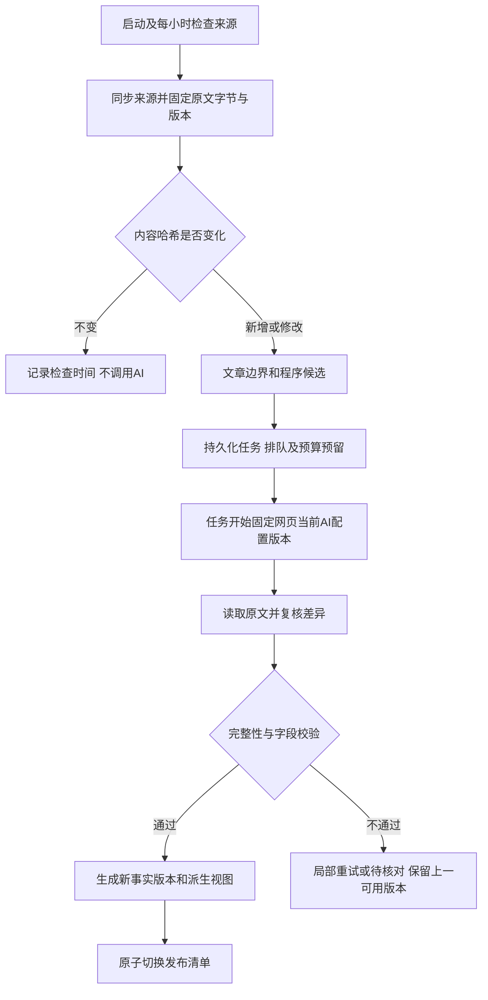

# 研究数据重构方案：程序提取，AI 复核，统一发布

状态：已获用户批准并进入开发。日期：2026-09-16。以下是基于 `6ed751a` / v0.4.4 的设计与当时审计记录；最新实现、测试结果和上线状态见 [开发交付说明](implementation-2026-09-16.md)。

## 建议采用的处理方式

保留并优化程序提取，生成可追溯的候选；AI 同时读取原文和候选，复核哪些保留、补充、修改、排除或暂缓判断；程序验证修改后形成统一版本。六类共享结构继续适用，变化的是结果的生产方式。

AI 必须读到本次处理范围的完整原文。只给它程序已有结果，会让漏掉的公司、文章、风险永远漏掉；只让它回答“对不对”，也不能完成补漏。为减少候选诱导，提示词要求先按原文识别主语和关系，再对照候选，但这并不能保证消除模型偏差。

“结构内容要不要更改”指文章分类、主体关系和观点记录要不要更新。AI 不得自动修改数据结构、枚举、程序、提示词、证券主数据或网站配置。遇到现有结构表达不了的内容，保留原文并提交 `unsupported_value`，由后续版本处理。

## 项目审核发现

| 当前代码 | 已确认的行为或缺口 | 本次重构方向 |
| --- | --- | --- |
| `api/services/dataUpdate.ts` | 启动检查并每小时更新；更新串行，失败保留上次发布；流程尚未接入AI整理 | 保留调度入口，将来源同步与持久化复核队列分开 |
| `reportCache.ts:readSourceManifest` | 使用路径、大小、mtime、ctime形成快速指纹 | 快速发现候选变化后，按原始内容哈希判断是否需要付费复核 |
| `reportRecognition.ts` | 已有证券词库、无后缀代码、评级和字段绑定规则；组合、跨句、相邻数字仍有错误 | 保留词库与确定性解析，重做文章/列表/句子范围和数字类型约束 |
| `opinionExtractor.ts`、`api/domain/research.ts` | 评级是宽泛字符串；五类观点类型固定；公司/证券混合 | 固定共用枚举与身份层级，候选不等于合格事实 |
| `opinionResolution.ts` | 按报告+机构+证券合并，再分别取评级、动作和价格 | 只合并同文章、同发言方、同主体、同时间和条件的重复陈述 |
| `reportIndex.ts:getCompanyProfiles` | 最新评级和最新目标价可能分别取自不同观点 | 改为完整观点快照；历史最后已知值另行标注来源 |
| `aiService.ts`、`aiBuyList.ts` | 买入清单会直接读取规则结果，绕过模型 | 改读已发布的统一事实，不能从旧规则清单绕回错误结果 |
| `aiProvider.ts` | 默认输出上限适合对话；非空正文可能被当作完成；流式输出没有作为完整结构事务提交 | 单独的结构化复核调用，检查finish reason、完整JSON、引用和差异 |
| `aiConfig.ts` | 三个独立profile、全站当前profile、独立加密Key已存在 | 复用配置；任务开始时固定profile版本，途中不混用模型 |
| `aiUsage.ts`、`aiService.ts` | 现有额度持久化，但并发控制在对话服务内；没有统一后台任务资源管理 | 对话与后台复核共用并发/额度预留器，分别记录实际和估算用量 |
| `publicationStore.ts` | 已有候选快照与原子切换 | 保留此发布机制，让全部消费者绑定同一代事实和原文 |

在真实的2026-09-08报告中复跑现有规则：第16行已能把“同时覆盖国电南瑞”识别为国电南瑞；第223行仍把“野村证券核心推荐股票”列为公司，四家真实公司的评级为空，中际旭创的目标价误为2281元。第197行漏掉赣锋锂业和天齐锂业的评级。第630—635行存在事件标题和CM身份误配。不能因为一个反例修好，就判断整体规则准确。

## 六类内容的字段与可选项

完整机器可读取值见 [共用枚举表](research-vocabulary-v1.json)。它是本次建议冻结的唯一取值来源，实施时生成TypeScript类型、表单选项、提示词和Schema；不能在前后端各复制一份。

### 1. 报告与文章

保存报告身份、原文版本、日期、文章边界、机构、摘要、来源及证据。

- 文章类型：公司研究、行业研究、宏观、策略、混合、未知。
- 标题来源：原文标题、生成标题。
- 日期精度：日、月、季度、年、未知。精确日期未知时不补成月初或年初。
- 报告状态：有效、已撤回。
- 来源变化：新增、修改、更名/移动、撤回、不变。
- 摘要、明确文章日期、机构均可缺失并说明状态；没有评级也可以是一篇完整文章。摘要与原文区别展示。

### 2. 公司与证券

公司、证券、交易挂牌三层分开；名称、代码、市场和原文提及角色分别存。

- 组织类型：公司、研究机构、其他、未知；组织在某处的角色由提及决定。
- 证券类型：普通股、优先股、存托凭证、REIT、ETF、基金、其他、未知。默认股票推荐统计只纳入配置允许的证券类型。
- 市场范围：A股、港股、美股，以及现有代码支持的新加坡、台湾、日本、韩国、其他、未知；市场范围不等于精确交易场所。
- 挂牌状态：正常、暂停交易、已退市、未知。
- 提及角色：文章主体、推荐标的、同行、客户/供应商、发布者、分析师、术语、其他、未知。
- 解析结果：已解析、有歧义、未解析、有冲突。

代码优先，但先确认它在原文中确实是证券代码。明确市场代码→有上下文与词库支持的无后缀代码→标准名称/别名。`600098`、`0700`、`BZ`都应支持；`CM`和`ESS`不能见到大写就认作美股。代码与名字冲突不强配。原文代码 `rawCode` 与词库解析代码 `resolvedCode` 分开，AI不能因原文缺代码就删除已经核实的身份映射。

### 3. 研究观点

一条观点绑定文章、发言机构、主体、时间、条件、评级、推荐、价格、理由和证据。

| 展示评级 | 代码 | 兼容的原文写法 |
| --- | --- | --- |
| 买入 | buy | 买入、Buy；买入/高风险另外保留风险限定 |
| 增持 | overweight | 增持、超配、Overweight、OW、跑赢、优于大市 |
| 中性 | neutral | 中性、Neutral |
| 持有 | hold | 持有、Hold |
| 减持 | underweight | 减持、Underweight、UW、跑输、弱于大市、低于行业表现 |
| 卖出 | sell | 卖出、Sell |
| 其他原文评级 | other | 原文确有评级，但暂无可靠映射 |

六档主评级沿用现有页面口径，“其他”是有原文但未映射的兜底。未陈述、有歧义、不适用是字段状态；未覆盖、暂不评级是覆盖状态，均不塞进六档。保留原评级、评级体系、比较基准、期限和风险限定；“跑赢”映射到“增持”只为展示兼容，不代表它们的经济含义或不同券商的尺度相同。数字评级不能脱离机构体系直接按1/2/3映射。

- 明确推荐：买入、持有、卖出、首选、积极看法、回避、其他；与正式评级分字段存放。
- 评级动作：维持、上调、下调、首次覆盖、恢复覆盖、撤回、其他。
- 目标价动作：维持、上调、下调、首次给出、撤回、其他。
- 价格：点值或区间；金额用十进制字符串。币种经核验的货币代码或未知；单位每股、每ADS、指数点、其他、未知。目标价、原目标价、原文现价分别存。
- 主体范围：公司、证券、挂牌、主题、市场、未解析。
- 发言来源：文章发布者、被引用机构、未知。
- 语义：肯定/否定/未知；实际陈述/条件/假设/未知；当前/历史/未知。
- 共同评级：评级、推荐、两者都有；明确成员列表，每家公司分别生成记录。

当前明确买入清单只纳入当前、肯定、实际成立、相关字段与主体关系通过检查的买入评级或明确买入建议。“首选”“看好”不能自动变为正式买入评级。

### 4. 风险与催化剂

事件类型固定为风险、催化剂；保存内容、影响对象、证据、条件、时间窗口以及关联观点。主体可以是公司、证券、行业或宏观市场，不要求有评级。

- 事件时间语境：当前、历史、未来、未知。
- 条件和否定：与观点使用同一套语义字段。
- 后续可选兑现状态：未跟踪、待发生、已发生、未发生、取消、未知。不能因为日期已到就自动标为已发生。

现有 `SignalType` 还有 valuation/financial/macro。这些内容迁移到文章内容分类、主题和原文证据中保留，不伪装成风险/催化剂，也不在重构时丢弃。完整财务指标表后续作为独立模块加入。

### 5. 行业与主题

分类维度固定：行业、主题、市场范围。来源固定：原文标签、AI建议、人工维护。分类项状态：候选、已批准、已停用。

具体行业和主题名称使用可版本化的分类表，不把未来可能出现的名称全部硬编码成枚举。原文标签和AI新增标签分开；AI不能宣称自己推断的“光模块”是原文已有标签。`AH`属于市场范围，不能作为机构。

### 6. 证据与质量

- 字段状态：明确陈述、未陈述、有歧义、不适用。
- 程序校验：通过、待核对、拒绝。
- 人工状态：未复核、已确认、已订正、已拒绝。
- 发布就绪：旧规则未复核、待处理、就绪、部分完成、失败、撤回。
- 任务状态：排队、运行、等待重试、预算暂停、成功、失败、已过期、已取消；单次API尝试另记运行/成功/失败/取消。
- 复核操作：不变、增加、修改、删除、暂缓判断。
- 问题类型：主体角色、机构归属、身份冲突、时间歧义、评级冲突、价格冲突、证据无法定位、范围遗漏、输出不完整、不支持的取值、供应商错误、其他。
- 严重性：提示、警告、错误。问题状态：未处理、已解决、已驳回。
- 变更原因：原文更新、规则纠错、AI复核、身份解析、人工订正。操作者：系统、AI、人工。

AI自报置信度不等于正确率，不决定是否“已确认”。证据必须定位到不可变原文版本的真实范围，字符偏移、行号、逐字引用一致。

## 程序先做哪些优化

1. **先识别文章、列表、句子，再分配字段。** 明确评级与目标价的局部作用范围；共同评级向明确列表展开；列表中的代码、年份、EPS、现价不能进入目标价字段。
2. **把提及与观点分开。** 标题、机构、同行、术语保留其原文角色，不因出现“买入”就变成评级公司。
3. **分开原文与解析。** 原文名字/代码、词库标准身份、解析依据和有效期分别保存。改善实体识别不覆盖原文。
4. **类型与状态固定。** 评级、覆盖、推荐、时间、否定、条件、价格单位用共用枚举；缺失保持缺失。
5. **每个候选携带字段证据和范围。** 候选有稳定ID及内容哈希；评级来源、价格来源和机构来源分开，减少整段复制。
6. **补漏检查覆盖全文。** 程序为所有文章记录是否已处理，不以“有候选的段落”代替全文。复杂或零候选文章仍可送AI核对。

优先修复真实反例以及相邻数字误取、跨公司绑定这些确定性问题，再比较优化后的规则基线与AI增益。不能用本轮现有旧规则的错误率代表优化后的效果。

## AI复核协议

输入固定：schema/枚举/规则/提示词版本、原文版本与范围、必要的文章上下文、程序候选、当前已发布版本的差异摘要、已验证的身份候选。三家模型使用同一语义提示词；认证头、超时、推理设置、输出额度和结构化输出能力属于供应商适配层。

正式复核输出采用差异提案 `ReviewPatch`，而不是让AI重写所有不变记录：

| 字段 | 约束 |
| --- | --- |
| baseRevisionId、baseCandidateHash | 与这次候选版本完全一致，否则过期拒绝 |
| coverage | 本次实际阅读的原文范围；缺段不能整篇就绪 |
| operations | keep/add/modify/delete/defer；每个已有候选有一个完整处置，遗漏不默认为keep |
| candidateId | 修改/删除/保留/暂缓必须存在于当前候选；新增用局部ID |
| fieldChanges | 允许字段白名单、原值哈希、建议值、字段状态、证据引用 |
| reasonCode、reason | 为什么变化，区分纠错、原文变更、身份解析等 |
| evidenceRefs、issues | 引用真实来源；有矛盾原样保留并记录问题 |

同一候选可修改多个字段，但不能出现相互矛盾的两个操作。AI新增的实体只是提及/待解析对象；证券库、机构别名库由程序和可追溯来源维护。新增字段不在白名单内时提交问题，不让模型动态扩展结构。

`delete`须有明确误报证据，或经确认的完整作用范围重读；没有查到不能证明不存在。来源报告的撤回只由程序依据完整成功的来源同步判断，AI无权发起。`delete`仅从本次候选事实视图排除伪记录，保留操作、原文及历史。删除规则记录与撤回一份来源报告是不同动作。AI不能物理删除报告、用户配置或证券主数据。候选排除保留墓碑状态，禁止级联删除Organization、Security、Listing、别名、原文证据或人工订正。所有结构化消费者必须经统一发布视图过滤排除状态，旧index.mentions不能继续直接用于公司列表、Radar、导出和关注结果；原始文字仍可全文检索。

本轮小样输出为“完整修正记录+候选处置”，用于直接评分，尚不是正式Patch端到端测试。正式Patch协议须在实施阶段补齐Schema、应用器、冲突检查及回滚测试。

## 幻觉与误删的控制

程序执行四层检查：JSON/枚举是否合法；引用是否真实、属于同一原文范围；主体-机构-评级-价格关系和市场单位是否相容；Patch是否适用于当前基线且未超出允许范围。结构化输出只能约束格式，不能证明内容正确。[OpenAI官方说明](https://developers.openai.com/api/docs/guides/structured-outputs)

字面引用存在并不保证归属正确，程序也无法形式化证明全部语义。对未覆盖、否定、跨市场价格冲突、共同评级漏项和跨公司绑定建立明确反例测试。重大冲突暂缓相关字段，合格的其他字段可以保留；不能先删错记录再把未通过的新记录补进去。

AI对“没有”的判断须谨慎：输出为空且未覆盖所有输入范围，视为失败；没有评级的文章允许合法空观点，仍保留文章和全文检索。AI复核失败不静默把规则候选标为已复核。

新版本原文中的订正需要重新核对旧人工修改；有效人工订正不能被重跑静默覆盖。对比已发布事实时按业务身份与原文关系比较，而非数组序号或行号比较。

## 每小时更新的完整流程

小时定时器只负责同步和入队，不等待所有模型请求完成，也不因一次重试占住来源更新锁。后台队列可连续处理；一小时是检查间隔，不承诺超长报告或额度不足时一小时内全部复核完成。现有单进程部署先使用持久化本地队列和单一资源管理器，无需立即引入外部消息中间件。

| 来源情况 | 行为 |
| --- | --- |
| 新报告 | 创建报告/原文版本，提取并复核后增加事实；处理期间显示待整理 |
| 原报告内容修改 | 创建原文新版本；首版重读整份变更报告以避免机构标题、共同评级作用范围变化漏传，后续才做按文章优化 |
| 只改mtime、拉取提交但原文相同 | 不调用AI，不重复付费 |
| 文件移动或更名 | 按来源稳定ID或迁移映射继承身份；无法判断则提交问题，不靠名称猜测 |
| 来源真正删除 | 仅在来源同步完整成功且删除确认后标撤回；拉取失败/空扫描不等于撤回全库 |
| 处理期间原文再次变化 | 当前任务标过期；不得覆盖新原文的新结果，新版本入队 |
| 网页切换当前模型 | 网页当前 profile 只影响助手对话和人工连接测试；线上自动复核固定读取最近保存的 DeepSeek profile。任务开始后固定该 profile，运行中的任务不混用模型 |
| 当前模型无效或Key失效 | 明确失败类型，保留上次结果；不擅自换成另一个已存模型 |
| 人工订正、词库变化 | 单独版本化；能重新解析身份就不重新调用模型；需要语义重读时显式排队 |

去重键包含报告原文哈希、规则版本、复核协议/提示词版本、模型配置语义版本。Key轮换本身不是事实变化，不触发重算；配置引用能追踪版本但不存密钥。超时后重试可能产生额外供应商费用，保留每次尝试，不能宣称网络失败就没有收费。

新旧原文不混在同一条观点内。修改中的报告可以继续展示上一份完整已发布版本并注明有新版待处理；新报告可先提供原文阅读和待整理状态，但不把新原文挂到旧证据链接下。各页面的统计、检索、问答引用同一个publicationId。

## 模型配置、预算与错误处理

复用三个独立Key的profile。新增配置项建议分成两组：全站共享的后台总预算/并发/重试上限，以及各profile自己的复核超时、最大输出和推理模式。相同字段不能既存全局又随模型切换被覆盖。

“测试连接成功”与“通过结构化复核验收”分别记录。每个profile保存验收所用协议/提示词版本及结论；当前模型未通过该版本的结构化验收时，后台任务明确显示配置待验证，不把能聊天当作能发布。切换模型不会自动激活其他Key或继承另一个模型的合格结论。

首版后台并发1，和对话共享已配置总并发上限；为交互保留可用容量。请求前预留输入、输出及可能的推理额度；完成后按供应商usage对账，未知用量保守保留。后台任务和对话分别统计，但不能各自把同一个每日上限再用一遍。

网络/429/5xx可有限退避重试；401/403不自动重复烧请求；模型名或参数错误先标配置不兼容；截断缩小原文分块或调整已允许的输出配置；语义错误最多进行有范围的纠错复核，仍失败则待核对。所有重试受统一预算与次数限制。用户页面区分管理员认证、供应商Key、模型不存在、额度、超时、截断、格式和证据问题。

默认仅调用当前模型，不做三模型常态投票；三个配置的测试是上线资格评估，不代表每次日报都调用三次。输出证据使用局部引用、keep只返回ID、仅重试失败块，以减少重复输出；仍需要覆盖原文，不能先承诺一定比全量抽取节省多少token。

## 样本评测与通过标准

本轮实测详情与脱敏产物见 [模型对比报告](evaluation-2026-09-16/README.md)。固定8个样本（4个真实段落+4个构造边界），程序候选来自当前代码，18条期望当前评级/价格事实在请求前固定。基础提示词与公共提示词各一轮；供应商参数调整另记，不把参数变化产生的差异全部归功于提示词。

本轮检查的是关键评级、价格、身份、证据、候选处置、标签与少量事件。尚未验证六类完整Schema、多文章长报告、历史有效期、正式Patch、断点恢复及跨页面发布，因此即使18/18也不能说已达到生产标准。

生产验收建议：

- 六类Schema、引用可定位、Patch基线检查及已知严重反例必须全部通过；越权修改、伪造引用、漏报告范围均阻止对应发布。
- 再扩展至少30份按长短、机构、市场和问题类型分层的真实报告，调参集与留出集分开；留出集失败不得悄悄挪回调参集再算通过。
- 对人工标注的主体-机构-评级-价格关系，目标精确率≥99%、召回率≥95%；同时报告原始输出和经过拒绝/暂缓后的指标、待核对率，不能靠全拒绝刷精确率。这些是待审核的验收目标，不是已测成绩。
- 显式买入的假阳性、跨公司目标价串用、未覆盖被当买入、虚构引用等严重错误，在回归集要求零例；不据此保证未来零错误。
- 对每个profile独立记录首次成功率、重试率、延迟、输入/输出/推理用量、费用、异常类型；模型或公共提示词升级重新回归。

## 实施拆分及验收产物

| 阶段 | 主要修改 | 交付与退出标准 |
| --- | --- | --- |
| 1 固定合同与规则基线 | 共用枚举、Claim、身份/文章/候选模型；修复确定性字段错绑 | 六类字典与Schema一致，真实反例有金标准，规则结果可独立复现 |
| 2 复核器和供应商适配 | 新建review协议、Patch应用器、完整响应解析；复用aiConfig | 同样本三profile独立报告，引用/截断/冲突负例通过，凭据不进入事实或日志 |
| 3 增量队列 | dataUpdate入队、持久化任务、共用额度和并发、源哈希幂等 | 无变化零调用；新增/修改/撤回/并发更新/重启/重试全部有明确结果 |
| 4 统一消费者与影子验证 | reportIndex、company/search/buyList/assistant读取同一发布版本 | 新管线先产候选并对比，不直接替换线上统计；查询和来源链接一致 |
| 5 存量重整和正式切换 | 固定全量清单、分批、优先近期与已知错误；按报告发布 | 已完成/待处理/失败/待核对可对账；保留原文、人工配置和回滚指针 |

改动以现有代码为入口，不在一个巨型函数中串起所有步骤。建议新增的职责模块为：共用schema/枚举、规则候选适配、AI复核协议与校验、任务存储与工作器、统一事实存储与视图适配。具体文件名可在实施时按项目习惯确定。

首版保留现有本地快照和单进程部署；向量库、外部队列、行情回测、完整财务指标和用户交易数据不作为此次上线依赖。未来多进程部署必须先把队列租约、额度和发布锁迁到共享存储。

## 审核结论

已完成GPT-5.6 Luna Max的独立代码与方案审查，详见[审查记录](luna-rule-audit.md)。规则抽取与消费者问题已由实际代码和真实fixture复现。独立审核重点要求：禁止候选删除级联主数据、原文代码与解析代码分离、小样DTO不得直接充当生产Patch；这些约束已写入本方案，实施时仍需验证。

三个已配置模型完成9次有界测试。适配参数与公共提示词后，三者都提对本组18条核心评级/价格，但都存在尚未满足全部标准的问题：GLM仍有格式/引文及简称误认；DeepSeek和MiMo共同评级证据不完整，事件分类、疑点提示或机构字段也有遗漏。因此建议采纳混合架构，但不批准当前测试协议直接自动发布。

公共提示词应保留，且需要程序提供允许的候选ID、原文标签和带偏移的证据片段。规范输出优先引用片段ID；新增引用由程序在固定原文范围内精确定位。共同评级由显式SharedScope绑定成员和字段，缺组证据则相关评级待核对。AI不再同时承担身份归一、抄写证据、主数据更新和最终发布决策。

本轮已核验usage合计68,031 token，另一次超时用量未知；所有测试配置哈希保持不变。评估脚本未并入业务启动流程，未触发全库重整。

需要用户审核的是：六档评级兼容口径、原文/解析身份分离、规则候选+AI差异复核、严格发布与待核对状态、自动复核固定 DeepSeek、首版变更报告全文重读。审核通过后再进入业务实现与全库迁移。实现阶段已按此决定完成开发，网页模型切换语义保留给对话和人工测试。
