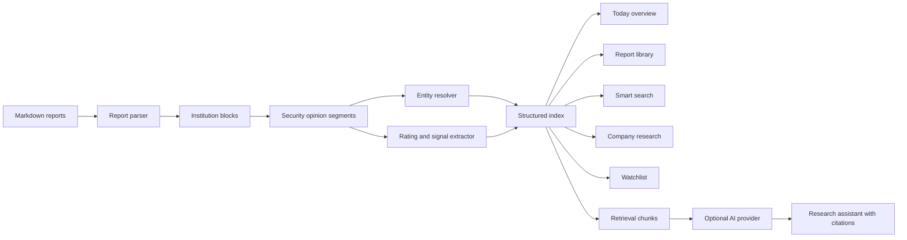

# Research Workbench 与研究助手重构设计

## 项目背景和目标

AnalyseStrategy 已经能够读取机构日报、生成内存索引并提供报告阅读、精确搜索、标的分析、研究雷达、关注列表和数据更新功能，但线上使用暴露出三个根本问题：

1. 信息架构按功能平铺，首页不能直接回答“今天有哪些值得关注的观点”。
2. 搜索按原始行返回，重复内容很多；股票识别以名称为主，无法稳定处理同一证券的多个译名或别名。
3. 研究雷达缺少明确使用场景，而用户真正需要的是每份日报里的买入、增持、首选股、评级变化和目标价变化速览。

本次重构把产品改造成双端友好的“今日研究工作台”，在不依赖 AI 的情况下提供完整、可追溯的研究体验，并新增一个可选的“研究助手”工作区承载全部 AI 能力。

本文所说的“全部报告”特指当前 `sourceDir` 中已成功索引的 Strategy 报告语料；AnalyseStrategy 代码仓库本身不作为研究语料。

## 设计原则

- **基础能力不依赖 AI**：未配置 AI、AI 服务失败或额度耗尽时，首页、报告库、搜索、公司研究、关注列表和数据更新仍然完整可用。
- **来源优先**：所有结构化结论和 AI 回答都能定位到报告日期、机构、文件和原文行。
- **代码优先识别证券**：上市代码是稳定身份；名称、英文名、译名和报告中的错误写法只作为别名。
- **降低人工过滤成本**：默认按报告和证券聚合，原始逐行结果作为可展开的证据层，而不是主结果层。
- **双端一致**：桌面端强调信息并列，手机端强调单手操作和渐进展开，不维护两套产品逻辑。
- **克制动画**：动画用于解释状态变化和空间关系，不阻塞操作，也不制造无意义等待。

## 信息架构

侧边栏和移动端主导航统一为以下入口：

1. **今日速览**：默认首页，展示最新日报、积极观点、评级/目标价变化、关注标的变化和快捷数据更新。
2. **报告库**：按日期、机构和观点类型浏览日报，并阅读原文。
3. **智能检索**：统一搜索证券名称、代码、机构和原文关键词。
4. **公司研究**：展示单只证券的稳定档案、历史观点和机构分歧。
5. **研究助手**：可选的 AI 检索增强问答工作区。
6. **关注列表**：维护重点证券并查看新增变化。
7. **数据更新**：执行 GitHub 更新、重新索引，查看变更、解析问题和应用版本。

现有“研究雷达”入口移除，其有价值内容重新归位：

- 最新积极观点和评级变化进入今日速览。
- 单只证券的趋势、催化剂、风险和机构分歧进入公司研究。
- 跨报告自由归纳进入研究助手。
- 旧 `/radar` 路由重定向到今日速览，避免旧书签失效。

## 今日速览

首页顶部包含：

- 当前日期、最新报告日期、最后索引时间和数据健康状态。
- 全局搜索框，支持键盘快捷键聚焦。
- “更新数据”按钮。点击后提供“从 GitHub 更新并重建”和“仅重新扫描报告”两个明确选项。
- 更新期间继续展示旧索引，按钮进入进度状态；更新成功后展示新增、修改、删除数量。

首页核心区域包含：

- **今日买入/积极观点**：去重后的买入、增持、跑赢、优于大市和首选股，显示证券、机构、目标价和动作。
- **日报速览**：每份报告显示积极观点数量、评级变化数量、目标价变化数量和可展开的证券标签。
- **关注变化**：仅展示关注列表中出现的新覆盖、评级变化、目标价变化和明确风险。
- **数据摘要**：报告数和有效证券数保留，但不再把机构标签计数作为首页核心指标。

## 报告库与报告速览

报告列表不再一次渲染全部 351 条记录。桌面端使用分页或窗口化列表，手机端使用按月份分组的增量加载。筛选条件包括年份、日期、机构和观点类型。

每份报告详情在 Markdown 原文之前展示结构化速览表：

| 字段 | 说明 |
| --- | --- |
| 证券 | 稳定名称和代码；无代码时显示报告名称并标记识别置信度 |
| 机构 | 对应一级机构块 |
| 评级 | 买入、增持、中性、持有、减持、卖出等标准化展示，保留原文评级 |
| 动作 | 首次覆盖、上调、下调、维持、重申或恢复覆盖 |
| 目标价 | 保留币种、单位和原文值 |
| 观点类型 | 买入、增持、首选、评级变化、目标价变化、风险或催化剂 |
| 来源 | 点击定位到 Markdown 原文行 |

默认优先展示买入、增持、跑赢、优于大市和首选股。用户可切换到“全部观点”或只看风险、催化剂和变化项。

## 证券识别与结构化提取

### 稳定证券身份

- 首选键为标准化交易代码，例如 `1768.HK`、`002475.SZ`。
- 无代码时才使用标准化名称，并将结果标记为低于代码匹配的置信度。
- 同一代码下的名称、英文名、简称和报告原文写法进入别名集合。
- 例如 `1768.HK` 报告中出现的“明明很忙”“鸣鸣很忙”“忙碌明”归并为同一证券，界面显示选定的标准名称，同时保留原始写法供追溯。
- `未覆盖`、`AH`、`AI`、评级词、市场标签和行业标签不得进入证券别名。

### 机构识别

- 一级标题只有满足机构名称规则时才建立机构块。
- 机构使用规范名和别名表归一化，例如精选前缀不制造新的机构实体。
- 行业、市场和主题标题不进入机构排行；无法确认时标记“待识别机构”，不伪装成有效机构。

### 上下文绑定

- 先按机构块切分，再按证券标题或高置信证券首次出现切分观点段落。
- 评级、动作、目标价、当前价、催化剂和风险只在当前观点段落内绑定，避免固定“向后八行”把下一只证券的信息串入当前证券。
- 显式表达优先于关键词推断，例如“维持买入评级”“目标价从 95 港元上调至 114 港元”优先于孤立出现的“买入”。
- 每个字段保存来源行、原文片段、提取方法和置信度。

### 可解释性

- 高置信结果直接展示。
- 低置信结果默认折叠，并显示“识别依据”。
- 每个结构化卡片提供“查看原文”。
- 数据更新页提供解析异常和待识别实体列表，方便补充别名或规则。

## 智能检索

智能检索接收一个输入框并按以下顺序判断意图：

1. 精确交易代码。
2. 已知证券名称或别名。
3. 已知机构名称。
4. 普通原文关键词。

结果展示规则：

- 证券查询首先展示公司研究摘要，再按报告分组展示命中。
- 机构查询展示该机构最近报告和主要观点。
- 普通关键词按报告聚合，相邻命中行合并为一个片段。
- 默认每个报告展示一个摘要和少量命中，用户主动展开后才显示全部原始行。
- 支持日期、机构、评级/目标价/信号类型筛选。
- 保留“严格原文模式”，供需要逐行核对的用户使用。
- 搜索结果中的 Markdown 高亮符号不直接以 `==` 裸文本显示。

## 公司研究

“标的分析”统一更名为“公司研究”，页面标题、导航、移动端标签和空状态文字全部来自同一份路由元数据，防止再次出现“指标的分析”和“标的分析”不一致。

公司研究页面包含：

- 稳定名称、代码、别名和识别依据。
- 最新评级、目标价、覆盖机构、首次和最近提及。
- 按时间排序的评级和目标价变化。
- 各机构最新观点矩阵。
- 机构共识与分歧，仅依据可验证评级和目标价计算。
- 催化剂、风险和估值片段。
- 历史报告列表及原文定位。

同一机构、同一证券、同一报告中的重复提及在结构化视图中合并，但原始报告仍完整保留。

## 关注列表

- 添加证券时复用稳定证券身份和别名解析，不再创建名称相近的重复关注项。
- 每个关注项展示上次查看之后的新报告、新评级、新目标价和新风险。
- 首页只展示发生变化的关注项。
- 移除操作需要明确确认，避免移动端误触。
- 导出继续支持 CSV，并补充稳定证券代码和来源行字段。

## 研究助手

### 定位

研究助手是独立工作区，承载全部 AI 能力。普通页面不散布大量 AI 按钮。用户可以询问单只证券、机构、主题或时间范围内的趋势、共识、分歧、催化剂与风险。

### 全局配置

- AI 配置是服务器级全局配置，不做账号级隔离。
- 配置字段包括服务商名称、API 基础地址、模型名、API Key、请求超时、每日额度和并发上限。
- API Key 只在服务端保存，返回前端时仅显示已配置状态和掩码尾部，不写入应用日志。
- 配置修改使用服务器端管理令牌保护；普通使用者共享 AI 能力，但不能读取明文密钥。
- UI 保存的密钥使用服务端 `AI_CONFIG_SECRET` 加密后写入 Git 忽略的运行时配置文件；未设置加密密钥时，只允许使用服务器环境变量配置，禁止把明文密钥落盘。
- 未配置 AI 时，研究助手展示配置说明，其他功能不受影响。

### 检索增强问答

1. 报告索引构建时按机构块、证券观点段落和来源行生成检索片段。
2. 问题先解析证券、机构、日期和观点类型范围。
3. 使用结构化元数据和全文相关性召回候选片段；向量检索作为可选增强，不是基础依赖。
4. 只把最相关且不重复的片段放入模型上下文，并严格限制上下文大小。
5. 模型生成回答时必须返回可解析的来源引用。
6. 前端把引用渲染为报告日期、机构和原文定位链接。

报告内容视为不可信数据，只用于事实检索，不能通过报告文本触发工具调用、修改配置、访问网络或执行外部动作。

### 使用体验

- 独立侧边栏入口名称为“研究助手”。
- 桌面端为会话列表和聊天区；手机端默认只显示聊天区，会话列表从抽屉打开。
- 支持全部报告、日期范围、证券和机构范围筛选。
- 回答采用流式输出，生成过程中可停止。
- 提供常用问题模板，例如“总结某公司近半年评级趋势”和“本周有哪些新增买入”。
- 会话保存在当前浏览器，不建立用户账号或跨用户共享历史。
- 回答缓存键包含问题、范围、模型和索引版本；报告更新后旧缓存自动失效。

### 问答体验增补（2026-08-27）

- “今天”“今日”“最新”优先使用报告库中最新报告；“本周”“最近一周”使用最新报告日期向前七天。回答同时说明服务器当前日期和报告库最新日期，不能把“今天没有新报告”误写成“没有可分析内容”。
- OpenRouter 推理模型使用低推理强度并隐藏推理字段，给最终答案预留明确的输出预算。若上游只返回推理、正文为空或以长度限制结束，服务端自动扩大最终答案预算重试一次；再次失败时返回可见错误，禁止缓存空答案。
- 模型输出采用 Markdown，优先给出核心结论、值得关注的公司、买入观点、催化剂、风险和来源编号。内部思维链不展示给用户。
- 当前会话携带有限的最近对话上下文，支持“它有什么风险”一类连续追问；会话列表和消息只保存在当前浏览器。
- 聊天区展示“正在检索报告”“正在分析来源”“正在生成回答”等即时状态，并支持停止、重新生成、复制、来源展开和原文跳转。
- 桌面端使用会话栏和主聊天区；手机端将会话栏与检索范围收进抽屉。输入框支持 Enter 发送、Shift+Enter 换行，并在用户接近底部时自动跟随流式输出。

### 成本与滥用控制

- 限制单次问题长度、召回片段数和最大输出长度。
- 设置全局并发上限、按来源地址的请求频率限制和每日总额度。
- 相同问题和相同索引版本优先使用缓存。
- 达到限制时返回清楚的中文提示，不影响非 AI 页面。

## 数据更新与版本

- 首页快捷按钮复用现有安全更新能力，不接受用户输入任意仓库路径。
- “从 GitHub 更新并重建”继续使用 `git pull --ff-only`。
- 同一时间只允许一个更新任务，重复点击复用当前任务状态。
- 重建完成前继续提供旧索引；成功后一次性切换到新索引。
- 更新结果展示新增、修改、删除报告及可点击的报告入口。
- 数据更新页保留源目录、Git 输出摘要、解析问题和数据质量面板。
- 应用版本从 `0.0.0` 更新为 `0.1.0`，并在侧边栏底部和数据更新页显示语义版本、Git 短提交和构建时间。

## 视觉与动画

- UI 使用系统无衬线字体保证操作界面清晰，Markdown 正文可以保留适度的编辑排版风格。
- 减少大面积米黄色和低对比度文字，提高桌面和手机的可读性。
- 页面进入、卡片展开、筛选变化和聊天消息使用 160–240ms 的轻量过渡。
- 列表加载使用与最终布局一致的骨架屏，避免内容跳动。
- 更新成功、保存成功和 AI 完成使用简短状态动画，不使用长时间庆祝效果。
- 尊重 `prefers-reduced-motion`，在减少动态效果模式下关闭位移动画。
- 所有按钮、输入框、筛选器和弹层满足键盘操作、焦点可见和触控尺寸要求。

## 数据流与模块边界

模块职责：

- `reportParser` 只负责把原始报告切分成带来源位置的结构。
- `entityResolver` 负责机构、证券代码、名称和别名归一化。
- `opinionExtractor` 负责评级、动作、目标价、催化剂和风险提取。
- `reportIndex` 负责索引构建、聚合、查询和原子切换。
- `searchService` 负责意图判断、分组、去重和原始模式。
- `aiService` 只消费检索片段和全局配置，不改变基础索引。
- React 页面通过明确的 API 类型消费数据，不在组件中重复业务推断。

## API 演进

现有 API 在迁移期间保持兼容，新页面优先使用以下能力：

- `GET /api/overview`：今日速览、报告变化、关注变化和版本状态。
- `GET /api/reports`：增加分页、月份、机构和观点类型筛选。
- `GET /api/reports/:id/overview`：返回报告级证券和观点速览。
- `GET /api/search`：增加分组模式，保留 `raw=true` 原始逐行模式。
- `GET /api/companies?q=`：返回稳定证券档案；旧 `/api/targets` 保持兼容。
- `GET /api/ai/status`：返回是否配置、模型、额度状态，不返回密钥。
- `PUT /api/ai/config`：使用管理令牌保存全局配置。
- `POST /api/ai/config/test`：测试配置，不持久化问题内容。
- `POST /api/ai/chat`：以流式响应返回回答和引用。
- `GET /api/version`：返回语义版本、提交和构建时间。

## 错误处理

- 报告目录不存在或不可读时，API 返回结构化错误，服务进程不得崩溃。
- 单篇报告解析失败时记录到数据质量面板，其余报告继续可用。
- Git 更新失败时保留旧索引，并显示可执行的错误说明。
- AI 未配置、鉴权失败、超时、限流或供应商错误使用不同错误码和用户提示。
- AI 流式响应中断时保留已生成文本，允许重试；不把半成品写入缓存。
- 无法生成可靠引用时，AI 回答必须提示证据不足，而不是输出无来源结论。
- 前端错误边界提供重试和返回入口，不直接显示底层 JSON 解析错误。

## 测试策略

### 解析与索引

- 使用 `1768.HK` 的多个名称验证代码优先归并。
- 验证 `AI`、`AH`、行业标题和 `未覆盖` 不进入机构或证券别名。
- 验证同一机构块内多只证券的评级和目标价不会串联。
- 验证买入、增持、跑赢、优于大市、首选股、维持、上调和下调的明确语句。
- 验证报告速览去重后仍保留全部原文来源。
- 验证索引失败时旧索引继续可查询。

### 搜索与页面

- 验证证券、代码、机构和普通关键词的意图分流。
- 验证相邻命中合并和按报告分组。
- 验证严格原文模式仍返回逐行结果。
- 验证路由元数据在桌面导航、移动导航和页面标题中一致。
- 验证首页更新按钮的空闲、确认、进行中、成功和失败状态。
- 验证关键桌面和手机视口，检查底部导航、弹层和报告阅读。

### 研究助手

- 使用模拟供应商验证无配置、配置测试、流式回答、停止、超时和限流。
- 验证 API Key 不出现在响应、日志和错误信息中。
- 验证检索范围和引用只能来自当前索引报告。
- 验证缓存随问题、范围、模型和索引版本变化。
- 验证报告中的提示性文本不会改变系统规则或触发外部动作。
- 验证 AI 失败时所有非 AI 功能正常运行。

### 发布验证

- 执行完整测试、TypeScript 检查、ESLint 和生产构建。
- 本地浏览器验证首页、报告速览、智能检索、公司研究、研究助手、关注列表和数据更新。
- 推送 GitHub 后，服务器只通过 `git pull --ff-only` 获取已推送提交。
- 服务器构建完成后重启 `analyse-api`，依次验证健康接口、概览接口、静态资源和关键双端页面。
- 核对线上版本、Git commit 和构建时间均与 GitHub 一致。

## 实施里程碑

1. **结构化数据基础**：完成机构识别、代码优先证券归并、观点段落切分、来源和置信度模型，以及兼容旧 API 的索引迁移。
2. **非 AI 产品体验**：完成统一导航、今日速览、报告速览、智能检索、公司研究、关注列表、首页更新和双端动画。到此里程碑时，即使完全不配置 AI，产品也应达到可发布状态。
3. **研究助手增量**：完成全局配置、检索片段、流式问答、引用、缓存、额度和安全控制。
4. **GitHub 与服务器发布**：完成版本注入、完整回归、GitHub 合并、服务器隔离构建、PM2 更新和线上双端验收。

## 发布顺序与回滚点

1. 在独立开发分支完成实现和验证。
2. 将已验证提交合并到 GitHub `main`，确认远端提交。
3. 记录服务器当前提交和静态构建目录作为回滚点。
4. 服务器执行 `git pull --ff-only`、依赖安装、测试和隔离构建。
5. 后端变更通过 PM2 重启生效，静态构建通过目录切换生效。
6. 完成 API、页面和版本核验后才宣布发布成功。
7. 发布失败时恢复上一份静态构建并重启上一提交对应的服务，不在服务器直接编辑业务代码。

## 非目标

- 本次不实现用户账号系统或按用户隔离 API Key、AI 配额和聊天历史。
- 不让 AI 修改原始 Markdown 报告、关注列表或系统配置。
- 不使用 AI 结果替代结构化买入速览和公司研究。
- 不把无法由报告原文支持的市场预测包装成事实。
- 不在首页恢复独立研究雷达或堆叠无明确动作的统计图表。
